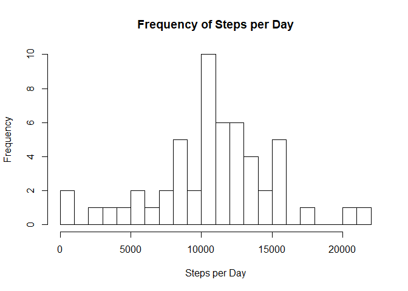
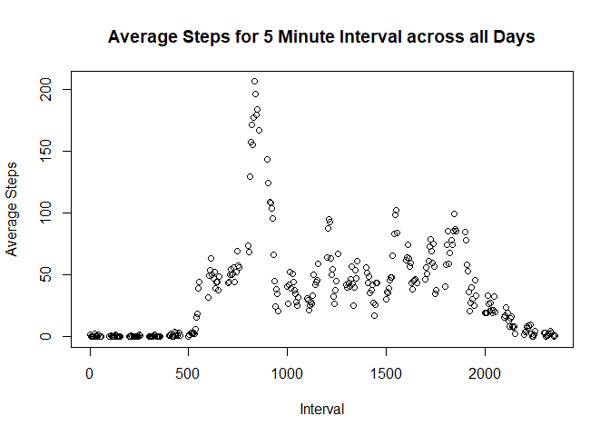

Download and read the data
==========================

    library(dplyr)

    ## 
    ## Attaching package: 'dplyr'

    ## The following objects are masked from 'package:stats':
    ## 
    ##     filter, lag

    ## The following objects are masked from 'package:base':
    ## 
    ##     intersect, setdiff, setequal, union

    library(ggplot2)
    library(lattice)

    fileURL = "https://d396qusza40orc.cloudfront.net/repdata%2Fdata%2Factivity.zip"
    dest_file = ".\\data\\repdata_data_activity.zip"
    download.file(fileURL,dest_file,method="curl")
    Sys.time()

    ## [1] "2020-04-22 11:11:48 AEST"

    data = read.csv(unz(dest_file,"activity.csv"),header=TRUE,stringsAsFactor=FALSE)

What is mean total number of steps taken per day?
=================================================

1.  Calculate the total number of steps taken per day

<!-- -->

    data$date = as.Date(data$date,"%Y-%m-%d")
    day = group_by(data,date)
    day_total = summarise(day,steps = sum(steps))

1.  Make a histogram of the total number of steps taken each day

<!-- -->

    hist(day_total$steps, breaks = 20, main="Frequency of Steps per Day", xlab="Steps per Day")

1.  Calculate and report the mean and median of the total number of
    steps taken per day

<!-- -->

    day_total_mean = round(mean(day_total$steps,na.rm=TRUE),digits=0)
    day_total_median = median(day_total$steps,na.rm=TRUE)
    day_total_sum = sum(day_total$steps,na.rm=TRUE)

*The mean number of total steps per day is 10766. Rounding has been
applied.*  
*The median number of total steps per day is 10765*  
*(This was not actually requested, however the total number of steps
across all days is 570608)*

What is the average daily activity pattern?
===========================================

1.  Make a time series plot (i.e. type = “l”) of the 5-minute interval
    (x-axis) and the average number of steps taken, averaged across all
    days (y-axis)

<!-- -->

    interval = group_by(data,interval)
    interval_average = summarise(interval,average_steps = mean(steps,na.rm=TRUE))
    plot(interval_average, main="Average Steps for 5 Minute Interval across all Days", xlab="Interval", ylab="Average Steps")

1.  Which 5-minute interval, on average across all the days in the
    dataset, contains the maximum number of steps?

<!-- -->

    interval_maximum_steps = interval_average[which.max(interval_average$average_steps),]$interval

*The interval containing the maximum number of steps, on average across
all days, is 835*

Imputing missing values
=======================

1.  Calculate and report the total number of missing values in the
    dataset (i.e. the total number of rows with NAs)

<!-- -->

    number_missing = sum(is.na(data$steps))

*The total number of missing values in the dataset is 2304*

1.  Devise a strategy for filling in all of the missing values in the
    dataset. The strategy does not need to be sophisticated. For
    example, you could use the mean/median for that day, or the mean for
    that 5-minute interval, etc.  
2.  Create a new dataset that is equal to the original dataset but with
    the missing data filled in.

<!-- -->

    data_imputed = merge(data, interval_average, by="interval")
    data_imputed$steps = ifelse(is.na(data_imputed$steps), data_imputed$average_steps, data_imputed$steps)

1.  Make a histogram of the total number of steps taken each day and
    Calculate and report the mean and median total number of steps taken
    per day.

<!-- -->

    day_imputed = group_by(data_imputed,date)
    day_imputed_total = summarise(day_imputed,steps = sum(steps))
    hist(day_imputed_total$steps, breaks = 20, main="Frequency of Steps per Day Including Imputed", xlab="Steps per Day Including Imputed")

    imputed_mean_steps = round(mean(day_imputed_total$steps,na.rm=TRUE),digits=0)
    imputed_median_steps = round(median(day_imputed_total$steps,na.rm=TRUE),digits=0)
    imputed_total_steps = round(sum(day_imputed_total$steps,na.rm=TRUE),digits=0)

*The mean number of steps per day, after missing values were replaced
with imputed values, is 10766. Rounding has been applied.*  
*(Prior to imputing missing values, the mean number of total steps per
day was 10766. Rounding had been applied.)*  
*The median number of steps per day, after missing values were replaced
with imputed values, is 10766. Rounding has been applied (as an
unrounded mean was used to impute missing values).*  
*(Prior to imputing missing values, the median number of total steps per
day was 10765)*

Do these values differ from the estimates from the first part of the
assignment?  
*Most of the values are the same; however, the occurrence of the most
commonly occuring numbers of steps have nearly doubled.*

What is the impact of imputing missing data on the estimates of the
total daily number of steps?  
*The mean and the median total daily numbers of steps are practically
unchanged. This makes sense as we used the mean to set the missing
values.*  
*The TOTAL number of steps has of course increased. The previous total
number of steps was 570608, but after imputing the total number of steps
is 656738)*

Are there differences in activity patterns between weekdays and weekends?
=========================================================================

1.  Create a new factor variable in the dataset with two levels –
    “weekday” and “weekend” indicating whether a given date is a weekday
    or weekend day.

<!-- -->

    day_of_week = mutate(data_imputed, day_type = as.factor(ifelse(weekdays(data_imputed$date) %in% c("Saturday","Sunday"), "weekend","weekday")))

1.  Make a panel plot containing a time series plot (i.e. type=“l”) of
    the 5-minute interval (x-axis) and the average number of steps
    taken,  
    averaged across all weekday days or weekend days (y-axis).  
    See the README file in the GitHub repository to see an example of
    what this plot should look like using simulated data.

<!-- -->

    day_of_week_average = group_by(day_of_week, interval, day_type)
    day_of_week_average = summarise(day_of_week_average,steps = mean(steps))
    xyplot(day_of_week_average$steps ~ day_of_week_average$interval | day_of_week_average$day_type, layout=c(1,2), type="l", xlab="Interval", ylab="Number of steps")

*Overall the pattern is the same between weekdays and weekends; however,
there is a peak of activity around 8:30 a.m. on weekdays that does not
occur on the weekend, and the weekend has a slightly higher level of
activity from around 10 a.m. to 5 p.m. This would be consistent with
travel for weekday activities, e.g. work and school, and is also
consistent with the peak seen around 8:30 a.m. in the “Average Steps for
5 Minute Interval across all Days” graph; that peak in the graph would
be due to the peak seen at this time in weekdays. As there are 5
weekdays to 2 weekend days, the peak appears to be more pronounced in
the “Average Steps for 5 Minute Interval across all Days” graph than
when compared to the weekday graph.*
